# System Architecture Overview

This document ties together architectural decisions currently scattered across [`thread_model.md`](thread_model.md) and past conversations into one overall picture, so someone new to the project (or a new session) can get the whole picture before diving into individual documents. Detail (layering rationale, the full thread/lock inventory) is kept in those documents; it isn't duplicated here.

## Component diagram

```mermaid
flowchart LR
    subgraph VENUES["Exchanges (Binance / Bybit / OKX)"]
        direction TB
        WS["WebSocket feed<br/>(L2 diff / trade)"]
        REST["REST snapshot<br/>(orderbook snapshot)"]
    end

    subgraph T_IO["io_threads_pool (configurable count, default 1)<br/>shared by every venue on the server side"]
        direction TB
        VS["VenueSession&lt;Feed, Policy&gt;<br/>per venue+market, own strand<br/>reconnect/backoff (jitter)"]
        VF["VenueFeed<br/>parse/encode, per exchange"]
        SS["SymbolSync&lt;SequencePolicy&gt;<br/>per venue+symbol resync"]
        SR["SymbolRegistry<br/>symbol → SymbolBook*"]
        VS --> VF --> SS --> SR
    end

    subgraph T_HB["heartbeat_thread<br/>1s loop"]
        HBOP["send_heartbeat()"]
    end

    SB{{"SymbolBook::mutex_<br/>cross-thread rendezvous point<br/>AggregateOrderBook + subscribers"}}

    subgraph T_GRPC["gRPC sync-server thread pool<br/>server-side subscriber threads (managed by the gRPC library)"]
        FAN["Fanout::broadcast()<br/>→ push_or_close() into each SubscriberQueue"]
        SEND["wait_and_drain(50ms)<br/>→ writer->Write()"]
        FAN --> SEND
    end

    RPC[/"gRPC: SubscribeL2Diff / SubscribeBbo / ListBooks<br/>aggregator.proto (crosses a process boundary)"/]

    subgraph T_CLIENT["client-side process — Reader thread<br/>one per book subscribed"]
        RD["mode: bbo / volume-bands / price-bands / list"]
    end

    OUT["stdout"]

    WS --> VS
    REST --> VS
    SR -->|"direct in-process call, no IPC"| SB
    HBOP --> SB
    SB --> FAN
    SEND --> RPC --> RD --> OUT

    style SB fill:#f97583,color:#000,stroke:#c62839,stroke-width:2px
    style T_IO fill:#5aa9ff22,stroke:#1a6fd6
    style T_HB fill:#ffb45422,stroke:#b5690b
    style T_GRPC fill:#7ee78722,stroke:#1a7a3c
    style T_CLIENT fill:#7ee78722,stroke:#1a7a3c
```

Colored boxes = thread boundaries (same color means the same thread, or the same class of thread), reusing [`thread_model.md`](thread_model.md)'s color scheme: blue = `io_threads_pool` (the config file's `"io_threads"` field; unset means 1, i.e. every existing deployment's behavior), orange = `heartbeat_thread`, green = threads managed by gRPC (the server-side subscriber thread pool and the client-side Reader thread — two different processes), red hexagon = the main cross-thread lock on the data path (`SymbolBook::mutex_`) — not the only cross-thread lock in the system, just the only one drawn here; each subscriber's own `SubscriberQueue::mutex_`/`cv_`, and the shutdown-only `shutdown_mutex`/`shutdown_cv`, are also cross-thread sync points not shown on this diagram. This only labels components down to "which thread does this run on" — for the full lock inventory, wait/timeout detail, and what actually happens when `io_threads > 1`, see [`thread_model.md`](thread_model.md).

## Layer by layer

### 1. Venue layer — WebSocket / REST

Each exchange's native protocol (Binance / Bybit / OKX, both spot and futures/perp). WebSocket carries incremental L2 diffs; REST is used for the initial snapshot and for re-fetching after a resync.

### 2. I/O driver layer — `VenueSession`

One `VenueSession` per venue+market, each with its own `net::strand`; a new generation of `WebSocketConnection` every reconnect (not a long-lived object), plus a one-shot `http_get()` (not a persistent connection object). Every `VenueSession` shares the same `io_threads_pool`, whose thread count is set by the config file's optional `"io_threads"` field, defaulting to 1 (effectively serialized execution); setting it higher lets different venues genuinely run in parallel — see [`thread_model.md`](thread_model.md) for detail.

### 3. sans-io core

A pure state machine, zero I/O, the main battleground for unit tests:

- **`VenueFeed`**: per-exchange parse/encode (e.g. `BinanceFuturesFeed`)
- **`SymbolSync<SequencePolicy>`**: per venue+symbol sequence-number validation and resync logic
- **`SymbolRegistry`**: a plain symbol → `SymbolBook*` lookup table; each `VenueSession` gets its own instance at construction, unchanged afterward

### 4. `AggregatorService` (gRPC server, a single process)

`std::unordered_map<symbol::BookId, SymbolBook> books_` is built at construction and never grows or shrinks afterward; ingestion writes (`apply_batch`/`apply_snapshot`/`invalidate_venue`), `heartbeat_thread` (`send_heartbeat`), and the `subscribe`/`unsubscribe` calls the gRPC subscriber threads make on connect/disconnect, all three go through the `SymbolBook::mutex_` rendezvous point. `Fanout::broadcast()` doesn't have its own lock — it borrows the one above — and pushes into each subscriber's independent `SubscriberQueue` via a non-blocking `push_or_close()`; but the gRPC subscriber thread that actually drains and sends those messages relies on each `SubscriberQueue`'s own `mutex_`/`cv_`, not `SymbolBook::mutex_`. See [`thread_model.md`](thread_model.md) for the full thread/lock inventory.

### 5. gRPC transport layer

Defined in `proto/bobby/hermeneutic/aggregator/aggregator.proto`:

- `SubscribeL2Diff` / `SubscribeBbo` — server-streaming, each its own independent subscription
- `ListBooks` — a unary query returning which books the server currently has

The conversion between the wire `BookId` and this project's own `symbol::BookId` (`symbol/symbol.hpp`) is concentrated at the single boundary `apps/aggregator/book_id.hpp`; `symbol.hpp` itself stays proto/gRPC-free.

### 6. Client — `apps/aggregator/client_main.cpp`

Picks one mode from the command line; each book subscribed gets its own Reader thread (blocking gRPC streaming `Read()`) plus a StreamCanceller thread:

- `bbo` — subscribes to `SubscribeBbo`
- `volume-bands` / `price-bands` — subscribes to `SubscribeL2Diff`, maintains the book locally and computes volume/price bands
- `list` — a single unary `ListBooks` query, never enters streaming mode

See [`thread_model.md`](thread_model.md) for thread-level detail.

## Known architectural limits

- **No real I/O parallelism by default**: `"io_threads"` defaults to 1 when unset (every existing deployment's behavior), so every venue shares a single thread; setting `"io_threads": N` (N>1) enables genuinely parallel ingestion, at the cost of real, previously-nonexistent lock contention on `SymbolBook::mutex_` — see [`thread_model.md`](thread_model.md) for detail.
- **SymbolSync reconnects blast too wide a radius**: a live data gap on a single symbol forces the entire shared `VenueSession` to reconnect, dragging down other symbols on the same session (known, currently accepted rather than fixed).
- **SymbolSync's snapshot fetch has no dedup**: there's no per-symbol REST fetch cancellation or backoff when nothing is consuming it, which could in theory hammer the REST endpoint (known).
- **The gRPC thread count is unbounded**: no `SetSyncServerOption` or `ResourceQuota` is configured, so the thread count grows linearly with the number of concurrently active streaming subscriptions.

## Related documents

- [`thread_model.md`](thread_model.md) — the full thread and lock inventory for both the server and client side
