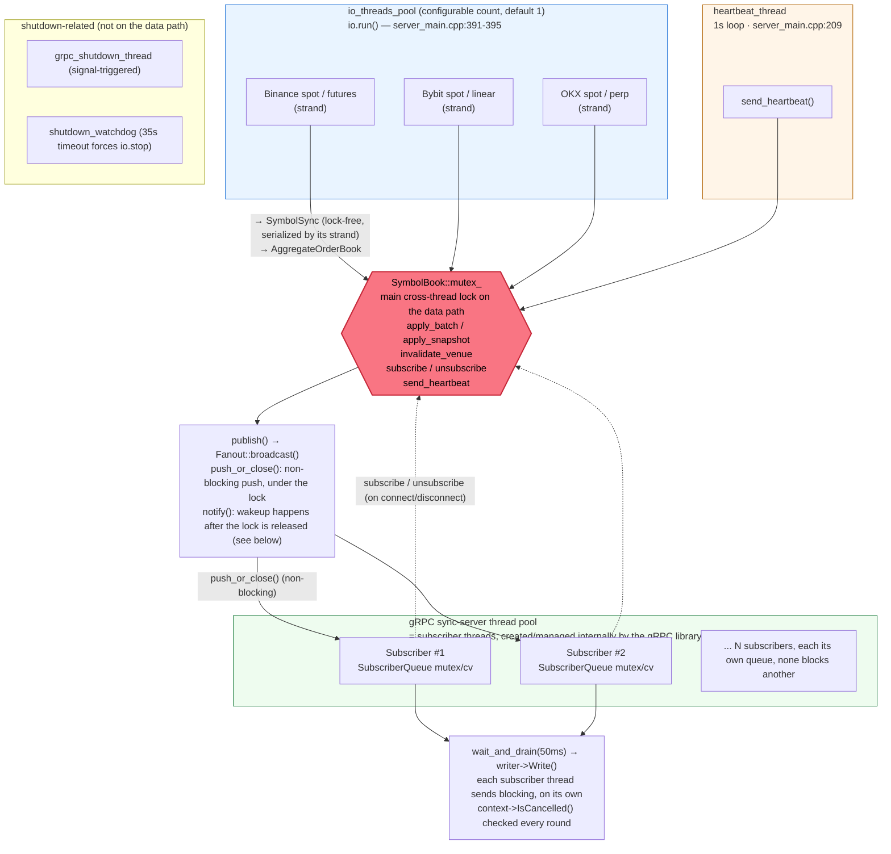
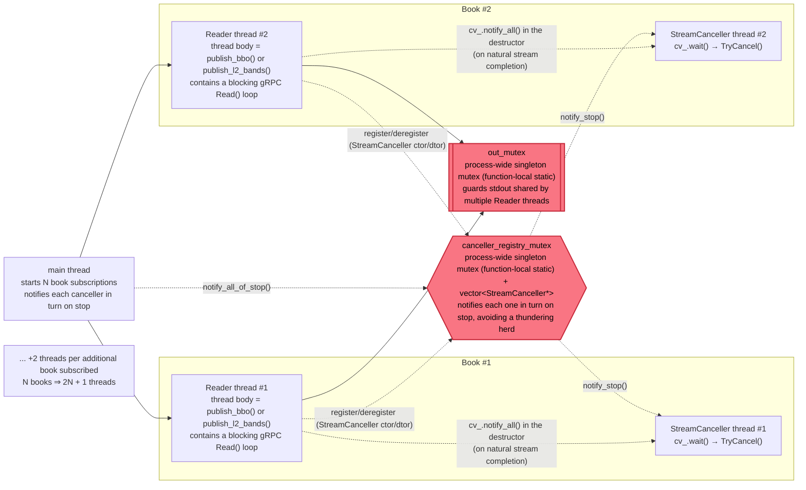

# Thread Model

Audited against the actual source (not a design document), 2026-09-22, updated later the same day to reflect the addition of the `io_threads` setting. Scope: `apps/aggregator/server_main.cpp`, `apps/aggregator/aggregator_service.hpp`, `include/bobby/hermeneutic/ingestion/venue_session.hpp`, `include/bobby/hermeneutic/ingestion/book_subscription.hpp`, `apps/aggregator/client_main.cpp`.

## Server side — Aggregator Service

**Legend**: blue = ingestion (`io_threads_pool`, default 1, configurable to more); orange = the heartbeat thread; red hexagon = a cross-thread lock (`mutex_`); green = threads managed by gRPC.

The number of threads in `io_threads_pool` is set by the config file's optional `"io_threads"` field (`book_subscription.hpp`'s `parse_io_threads()`, capped at 64); unset means 1 — the behavior every existing deployment already has. The following first describes that default (1 thread): a single OS thread runs every venue's ingestion, fully serialized, writing into `SymbolBook` via `apply_batch`/`apply_snapshot`/`invalidate_venue`; `heartbeat_thread` only ever calls `send_heartbeat()`; the gRPC subscriber thread pool calls `subscribe`/`unsubscribe` on connect/disconnect. All three go through the `SymbolBook::mutex_` rendezvous point — but it is not the only cross-thread lock in the system:

- Each subscriber's own `SubscriberQueue::mutex_`/`cv_` is a second-tier lock: while holding `SymbolBook::mutex_`, `Fanout::broadcast()` only calls `push_or_close()` (a non-blocking push that also reports whether this subscriber actually has something new to be woken for); the actual wakeup (`notify()`) is deferred until after `SymbolBook::mutex_` is released — the point being to shorten this hot-path lock's hold time, so waking N subscribers' worth of `notify_one()` calls doesn't add to time spent holding the lock. Actually draining messages out of the queue (`wait_and_drain`) is done by each gRPC subscriber thread on its own, guarded by that queue's own lock, unrelated to `SymbolBook::mutex_`.
- `shutdown_mutex` / `shutdown_cv` (`server_main.cpp:425-426`) is a third cross-thread sync point dedicated to shutdown: once every thread in `io_threads_pool` has been joined, it notifies `shutdown_watchdog`. Off the data path, unrelated to the two locks above.

### `io_threads > 1`: already supported, opt-in via config, not the default

Enabled via `"io_threads": N` (`book_subscription.hpp`'s `parse_io_threads()`). `boost::asio::io_context::run()` itself supports being called concurrently from multiple threads (the standard thread-pool pattern), and every `VenueSession` is strand-confined, so N>1 is safe on its own: different venues' (e.g. Binance-spot and OKX-spot) coroutines can genuinely run at the same time on different OS threads, each still serialized within its own strand — CPU work (JSON parsing, book diffing) can now overlap across venues instead of all being time-sliced on one thread.

- **`registry_.book()` remains safe**: not because of a lock, but because each `VenueSession` gets its own `SymbolRegistry` at construction, one that never changes afterward. Different sessions access different map instances, so there is no contention by construction.
- **The one thing that actually changes**: two `VenueSession`s feeding the same `SymbolBook` (cross-venue aggregation into one book) can now genuinely contend for `SymbolBook::mutex_` at the same instant — previously serialized for free by there being only one thread, never actually contended. The lock still correctly protects the data; there is just real lock contention now where there was none before, stacking on top of the already-known "holding the lock while broadcasting to a hot symbol" cost (not addressed here, a known limitation).  `AggregatorService::books_` never changes after construction and has long been read concurrently by the gRPC thread pool, so that's still fine too.
- **A former hazard, now fixed**: `log_exception()` (`venue_session.hpp:58`) and `execute_action()`'s rejected-level branch (`venue_session.hpp:511-518`) used to write to `std::cerr` via a chain of unsynchronized `<<` calls, which multiple threads writing at once could interleave into garbage. Both sites now build the full line into a `std::ostringstream` first and write it with a single `std::cerr << line.str()` call (the same technique `server_main.cpp`'s `on_signal`/`shutdown_watchdog` use). `thread_local rng` and the read-only shared `ssl_ctx` (OpenSSL supports creating independent streams concurrently) are both non-issues and need no fix.

## Client side — `client_main.cpp`

**Legend**: `main thread` starts each subscription and then waits; each book gets its own Reader thread + StreamCanceller thread. `canceller_registry_mutex` and `out_mutex` are the only two cross-thread locks here — both are function-local static singletons (exactly one instance, process-wide), not namespace-scope globals; they're just conventionally called "global locks". No asio / `io_context` at all here — plain blocking gRPC API + `std::thread`.

- **Reader thread (one per book)**: the thread body is `publish_bbo()` or `publish_l2_bands()` itself (`main()` passes them directly to `threads.emplace_back(publish_bbo, ...)` as the thread's entry point), and inside is a blocking gRPC synchronous streaming `Read()` loop that processes and prints each message in place — not a separate outer loop that calls them per message.
- **StreamCanceller thread (one per book)**: a dedicated thread; `cv_.wait()` waits for the stop signal, then calls `context.TryCancel()`.
- **`canceller_registry_mutex`**: a process-wide singleton lock (function-local static inside the `canceller_registry_mutex()` accessor) over a `vector<StreamCanceller*>`, notifies each entry in turn on stop, avoiding a thundering herd.
- **`out_mutex`**: guards stdout output shared by multiple Reader threads, also a function-local static singleton, just declared directly inside `print_line()` with no separate accessor — the same underlying technique as `canceller_registry_mutex`, differing only in whether there's a dedicated accessor function.

## Key caveats

> **No real I/O parallelism under the default config.** `"io_threads"` defaults to 1 when unset (every existing deployment's behavior): each `VenueSession` has its own `net::strand`, but only one thread calls `io.run()`, so every venue's ingestion is still effectively serialized on one CPU core. Setting `"io_threads": N` (N>1) lets different venues' strands genuinely run in parallel — for the details and the tradeoff (real lock contention on `SymbolBook::mutex_`), see the section above.

> **`SymbolSync` / `AggregateOrderBook` are not themselves thread-safe.** Both rely entirely on the caller guaranteeing single-threaded access (via a strand or `mutex_`). Any future code that bypasses this serialization and calls them directly would be a data race.

> **The gRPC thread count is unbounded.** No `SetSyncServerOption` or `ResourceQuota` is configured, so the thread count grows purely with the number of concurrently active streaming subscriptions, entirely up to gRPC internals.
